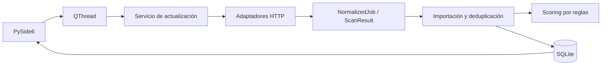

# JobTracker

Aplicación de escritorio para organizar ofertas IT y hacer seguimiento manual de
candidaturas. Desarrollada con **Python, PySide6 y SQLite** para Windows.
Los datos se guardan localmente; no necesita un servidor ni utiliza IA.

## Funcionalidades

- Adaptadores para fuentes públicas HTTP, HTML y JSON.
- Actualización con QThread, progreso real y errores por fuente.
- Normalización, deduplicación e importación transaccional en SQLite.
- Scoring explicable: experiencia, formación, ubicación, puesto e idiomas.
- Perfil configurable y recálculo de ofertas guardadas sin Internet.
- Ofertas nuevas, filtros rápidos, resumen diario y enlace al anuncio original.
- Seguimiento persistente: vista, interés, CV enviado y descartada.

**Alcance actual:** reglas y controles para Sevilla/provincia y remoto España.
Esta especialización forma parte del producto; no es un buscador geográfico
universal. El perfil publicado es una **demostración ficticia**, no los estudios,
experiencia, idiomas o preferencias de una persona.

## Ejecutar en Windows

Requisitos: Python 3.13 y escritura en la carpeta del proyecto.

```powershell
py -3.13 -m venv .venv
.\.venv\Scripts\python.exe -m pip install -r requirements.txt
.\.venv\Scripts\python.exe -m app.main
```

La primera ejecución crea `data/` y `logs/`, configura las empresas e incorpora
ofertas **ficticias de demostración**, ocultas por defecto. Activa el filtro de
datos de prueba para consultarlas. La consulta real comienza al pulsar
**Actualizar ofertas**, no al instalar el proyecto.

En **Configuración → Mi perfil de búsqueda** puedes ajustar modalidades,
categorías, experiencia máxima, antigüedad y exclusión de universidad obligatoria.
**Guardar y recalcular** trabaja exclusivamente con SQLite.

`app/config/profile.example.json` incluye también parámetros sin editor visual,
como idiomas y pesos. Si necesitas cambiarlos, cópialo a `app/config/profile.json`
antes de configurar el perfil en la UI. Ese archivo es privado y está excluido
de Git. Una vez guardado desde la UI, `data/search_profile.json` tiene prioridad.
Restaurar el perfil utiliza el perfil local si existe; en una instalación limpia,
utiliza el ejemplo.

## Arquitectura



| Carpeta | Responsabilidad |
| --- | --- |
| `app/ui` | Ventanas, filtros y tareas en segundo plano |
| `app/sources` | Lectura y normalización de cada portal |
| `app/services` | Actualización, importación y scoring |
| `app/database` | Repositorios, transacciones y migraciones |
| `app/config` | Configuración y ejemplo ficticio |
| `tests` | Pruebas offline con HTTP simulado y SQLite temporal |

Si una fuente falla, continúa la siguiente. Un escaneo incompleto no reemplaza
las ofertas guardadas de esa fuente. Las actualizaciones conservan los estados
manuales de las candidaturas.

## Fuentes y límites

Adaptadores: Sopra Steria, Izertis, Indra/Minsait, Deloitte, Accenture, Ayesa,
T-Systems, Emergya, Isotrol, InfoJobs y Tecnoempleo.

Un adaptador **no garantiza disponibilidad permanente**: los portales pueden
cambiar o limitar el acceso. InfoJobs ha devuelto protección JavaScript/cookies;
Indra/Minsait puede abortar si detecta ofertas repetidas entre páginas.
Tecnoempleo usa HTML/JSON-LD y omite fichas retiradas con HTTP 404/410.
LinkedIn no está integrado.

No se usan credenciales de candidatos, cookies personales, Selenium ni Playwright.
No se envían CV ni candidaturas. El scoring es orientativo: comprueba siempre
requisitos y vigencia en el anuncio original.

## Pruebas

```powershell
.\.venv\Scripts\python.exe -m pytest -q
```

Las pruebas utilizan perfiles sintéticos independientes de la configuración local.
No necesitan consultar portales ni acceder a una base de datos personal. GitHub
Actions ejecuta la suite en Windows con Python 3.13.

## Privacidad y publicación

Se excluyen bases de datos, candidaturas, notas, perfiles privados, logs, capturas,
backups e informes históricos. **No subas la carpeta de trabajo completa desde el
navegador:** `.gitignore` protege Git, pero no una selección manual de archivos.

```powershell
git add .
python tools/check_publication.py
python tools/export_public.py
```

El exportador crea `data/publication/JobTracker-public.zip` únicamente con el
contenido preparado para Git. Consulta [cómo publicarlo](docs/PUBLISHING.md) y
[el alcance de la revisión de privacidad](docs/PRIVACY.md).
